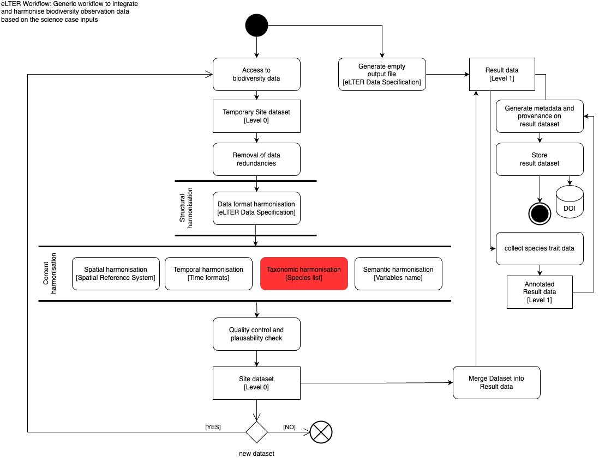

# Data product description
This data product follows the diagram provided in [Deliverable 10.3 (D10.3)](https://docs.google.com/document/d/1MJX2Vcj2LSIvW_6m4fFP_BKP60eCNYLplYVq3XHJrvU/edit) about Biodiversity loss.

The workflow aims to create a data product harmonizing and integrating biodiversity observation time series (covering different organism groups) to enable the analysis and modelling of biodiversity trends.

In this example of data product, 2 dataset that contains the values of density (cell/ml) and biomass (mm3/m3) of phytoplankton species detected in Lake Candia in the 1986 and in the 1987, were harmonised temporally, geographically, taxonomically and sematically, saved in a [rds file format](https://bookdown.org/csgillespie/efficientR/input-output.html) and then merged into a single package file ([RData](https://bookdown.org/ndphillips/YaRrr/rdata-files.html)), to which metadata was associated in XML format according to the Ecological Metadata Language (EML) standard.

# First dataset - Phytoplankton biomass and density in Lake Candia in the 1986

## Access to biodiversity data


The data is stored in a excel file that contains the values of density and biomass of phytoplankton species detected in Lake Candia in the 1986.
```{r, access_01}
phyto_candia_1986 <- readxl::read_excel(path = "phyto_Candia_1986.xlsx")
phyto_candia_1986
```

## Temporary Site dataset


The imported dataset is temporarily saved in the [rds file format](https://bookdown.org/csgillespie/efficientR/input-output.html). rds files are commonly used for saving R objects. Saving your R object as an rds file can be useful for sharing your work with others, replicating your analysis, or storing your work for later use.
```{r, temp_dataset_01}
# Saving on object in rds format
save(phyto_candia_1986, file = "phyto_candia_1986.rds")
```

## Structural harmonization


The structural harmonization step is missing because it is unclear which data structure eLTER is currently using.
The output of this step is stored in the rds file.
```{r, stru_harm_01}
# Saving on object in rds format
save(phyto_candia_1986, file = "phyto_candia_1986.rds")
```

## Spatial harmonization


The information about the coordinates (latitude and longitude) where the different species are observed is included in the spatial harmonization step.
The output of this step is stored in the rds file.
```{r, spa_harm_01}
# Add a coordinate if is missing
harmonized_phyto_candia_1986 <- phyto_candia_1986 |>
  dplyr::mutate(
    decimalLatitude = as.numeric(45.32530000),
    decimalLongitude = as.numeric(7.91529000)
  )

# Saving on object in rds format
save(harmonized_phyto_candia_1986, file = "phyto_candia_1986.rds")

# Transform dataframe to simple feature collection
# harmonized_phyto_candia_1986 <- harmonized_phyto_candia_1986 |>
#   sf::st_as_sf(coords = c("decimalLatitude", "decimalLongitude"), crs = 4326)
```

## Temporal harmonization


The time reference column has been renamed using the terminology suggested by the [controlled vocabulary (DwC)](https://dwc.tdwg.org/list/). Additionally, the content has been defined as a date using R [lubridate library](https://lubridate.tidyverse.org) to facilitate the transformation.
The output of this step is stored in the rds file.
```{r, temp_harm_01}
harmonized_phyto_candia_1986 <- harmonized_phyto_candia_1986 |>
  dplyr::mutate(
    eventData = lubridate::as_date(DATA_SAMPLE), .keep = "unused"
  )

# Saving on object in rds format
saveRDS(harmonized_phyto_candia_1986, file = "phyto_candia_1986.rds")
```

## Taxonomic harmonization


The dataset was taxonomically harmonised using the [taxon_id_worms](https://docs.ropensci.org/ReLTER/reference/taxon_id_worms.html) function from the [ReLTER package](https://docs.ropensci.org/ReLTER/index.html). This involved validating the species names and adding additional columns to the dataset, with headers suggested by the [DwC controlled vocabulary](https://dwc.tdwg.org/list/). These changes allow for better specification of the taxonomic aspects of the dataset, such as taxonRank, [LSID](https://en.wikipedia.org/wiki/LSID), and scientificNameAuthorship .
The output of this step is stored in the rds file.
```{r, taxa_harm_01}
harmonized_phyto_candia_1986 <- ReLTER::taxon_id_worms(
  input = harmonized_phyto_candia_1986,
  taxaColumn = 2,
  verbose = TRUE,
  refine = FALSE
)
# Saving on object in rds format
saveRDS(harmonized_phyto_candia_1986, file = "phyto_candia_1986.rds")
```

## Sematic harmonization


The previous steps began the harmonisation of terms, including temporal or taxonomic harmonisation. In this step, the column headings that were still missing have been modified using the terms recommended by the [DwC vocabulary](https://dwc.tdwg.org/list/). To convert between units of measurement for each column containing numerical values, the respective units have been associated using the [R units package](https://r-quantities.github.io/units/).
The output of this step is stored in the rds file.
```{r, sem_harm_01}
harmonized_phyto_candia_1986 <- harmonized_phyto_candia_1986 |>
  dplyr::select(-c("NAME", "CLASS")) |>
  dplyr::mutate(
    "#" = DENSITY,
    measurementValue = BIOVOLUME,
    .keep = "unused",
    .after = originalNameUsage
  )
harmonized_phyto_candia_1986$measurementValue <- units::set_units(as.double(harmonized_phyto_candia_1986$measurementValue), "mm3/m3")
# harmonized_phyto_candia_1986$`#` <- units::set_units(as.double(harmonized_phyto_candia_1986$`#`), "cell/ml")

# Saving on object in rds format
saveRDS(harmonized_phyto_candia_1986, file = "phyto_candia_1986.rds")
```

## Quality control and quality check

```{r, qc_01}

```

This step is missing because I don't know the what quality control to do on this data.

## Dataset 01 at Level 0


After undergoing quality control and harmonization, data about phytoplankton specie observed in 1986 appears as follows.
```{r, return_lev0_01}
# To load the data
level0_dataset_01 <- readRDS("phyto_candia_1986.rds")
level0_dataset_01
```

# Second dataset - Phytoplankton biomass and density in Lake Candia in the 1987

## Access to biodiversity data


The data are stored in an Excel file that contains the values of density and biomass of phytoplankton species detected in Lake Candia in 1987.
```{r, access_02}
phyto_candia_1987 <- readxl::read_excel(path = "phyto_Candia_1987.xlsx")
phyto_candia_1987
```

## Temporary Site dataset


The imported dataset is temporarily saved in the rds file format. rds files are commonly used for saving R objects. Saving your R object as an rds file can be useful for sharing your work with others, replicating your analysis, or storing your work for later use.
```{r, temp_dataset_02}
# Saving on object in rds format
save(phyto_candia_1987, file = "phyto_candia_1987.rds")
```

## Structural harmonization


The structural harmonization step is missing because it is unclear which data structure eLTER is currently using.
The output of this step is stored in the rds file.
```{r, stru_harm_02}
# Saving on object in rds format
save(phyto_candia_1987, file = "phyto_candia_1987.rds")
```

## Spatial harmonization


The information about the coordinates (latitude and longitude) where the different species are observed is included in the spatial harmonization step.
The output of this step is stored in the rds file.
```{r, spa_harm_02}
# Add a coordinate if is missing
harmonized_phyto_candia_1987 <- phyto_candia_1987 |>
  dplyr::mutate(
    decimalLatitude = as.numeric(45.32530000),
    decimalLongitude = as.numeric(7.91529000)
  )

# Saving on object in rds format
save(harmonized_phyto_candia_1987, file = "phyto_candia_1987.rds")

# Transform dataframe to simple feature collection
# harmonized_phyto_candia_1986 <- harmonized_phyto_candia_1986 |>
#   sf::st_as_sf(coords = c("decimalLatitude", "decimalLongitude"), crs = 4326)
```

## Temporal harmonization


The time reference column has been renamed using the terminology suggested by the [controlled vocabulary (DwC)](https://dwc.tdwg.org/list/). Additionally, the content has been defined as a date using R [lubridate library](https://lubridate.tidyverse.org) to facilitate the transformation.
The output of this step is stored in the rds file.
```{r, temp_harm_02}
harmonized_phyto_candia_1987 <- harmonized_phyto_candia_1987 |>
  dplyr::mutate(
    eventData = lubridate::as_date(DATA_SAMPLE), .keep = "unused"
  )

# Saving on object in rds format
saveRDS(harmonized_phyto_candia_1987, file = "phyto_candia_1987.rds")
```

## Taxonomic harmonization


The dataset was taxonomically harmonised using the [taxon_id_worms](https://docs.ropensci.org/ReLTER/reference/taxon_id_worms.html) function from the [ReLTER package](https://docs.ropensci.org/ReLTER/index.html). This involved validating the species names and adding additional columns to the dataset, with headers suggested by the [DwC controlled vocabulary](https://dwc.tdwg.org/list/). These changes allow for better specification of the taxonomic aspects of the dataset, such as taxonRank, [LSID](https://en.wikipedia.org/wiki/LSID), and scientificNameAuthorship .
The output of this step is stored in the rds file.
```{r, taxa_harm_02}
harmonized_phyto_candia_1987 <- ReLTER::taxon_id_worms(
  input = harmonized_phyto_candia_1987,
  taxaColumn = 2,
  verbose = TRUE,
  refine = FALSE
)
# Saving on object in rds format
saveRDS(harmonized_phyto_candia_1987, file = "phyto_candia_1987.rds")
```

## Sematic harmonization


The previous steps began the harmonisation of terms, including temporal or taxonomic harmonisation. In this step, the column headings that were still missing have been modified using the terms recommended by the [DwC vocabulary](https://dwc.tdwg.org/list/). To convert between units of measurement for each column containing numerical values, the respective units have been associated using the [R units package](https://r-quantities.github.io/units/).
The output of this step is stored in the rds file.
```{r, sem_harm_02}
harmonized_phyto_candia_1987 <- harmonized_phyto_candia_1987 |>
  dplyr::select(-c("NAME", "CLASS")) |>
  dplyr::mutate(
    "#" = DENSITY,
    measurementValue = BIOVOLUME,
    .keep = "unused",
    .after = originalNameUsage
  )
harmonized_phyto_candia_1987$measurementValue <- units::set_units(as.double(harmonized_phyto_candia_1987$measurementValue), "mm3/m3")
# harmonized_phyto_candia_1987$`#` <- units::set_units(as.double(harmonized_phyto_candia_1987$`#`), "cell/ml")

# Saving on object in rds format
saveRDS(harmonized_phyto_candia_1987, file = "phyto_candia_1987.rds")
```

## Quality control and quality check

```{r, qc_02}

```

This step is missing because I don't know the what quality control to do on this data.

## Dataset 02 at Level 0


After undergoing quality control and harmonization, data about phytoplankton specie observed in 1987 appears as follows.
```{r, return_lev0_02}
# To load the data
level0_dataset_02 <- readRDS("phyto_candia_1987.rds")
level0_dataset_02
```

# Merge Level 0 datasets in a result data (Level 1)

## Result dataset (Level 1)


The data was combined into one file. In this case, a typical [RStudio platform file (RData)](https://bookdown.org/ndphillips/YaRrr/rdata-files.html) was used because it can hold multiple datasets with varying structures. The data in the example have the same structure and columns after harmonization. However, there may be cases where this is not true, or where level 1 datasets contain data on different variables. In such cases, using RData files could help to package level 1 data together.
```{r}
save(level0_dataset_01, level0_dataset_02, file = "level1.RData")
load("level1.RData")
```

# Generate metadata and provenance on result dataset

## Metadata of the result dataset (Level 1) in EML


Following the flow, a medatada file is generated by [EML package](https://docs.ropensci.org/EML/index.html) for the level 1 dataset.
The metadata is stored in an XML file called level1.xml.
```{r, eml}
# 1. Attributes ----
# TODO

# 2. Data file format ----
physical <- EML::set_physical("level1.RData")

# 3. Assembling the dataTable ----
dataTable <- list(
  entityName = "level1.RData",
  entityDescription = "R file (RData) that contain 2 datasets about density (cell/ml) and biomass (mm3/m3) of phytoplankton sampling in the montly campains from January 1986 and Dicember 1987 and counting by inverted microscope. The datasets are harmonized by structural, spatial, temporal, taxonomic, and semantic folowing the gudeline of eLTER RI",
  physical = physical#,
  # attributeList = attributeList
)

# 4. Coverage metadata ----
geographicDescription <- "Lake Candia is located near the city of Tourin in the northern-western Italy and belongs to the Italian, European and International Long-Term Ecological Research (LTER) Networks: Candia (https://deims.org/c7fe4203-24b1-4d11-a573-99b99204fede)."

coverage <- EML::set_coverage(
  begin = '1986-03-06',
  end = '1987-12-02',
  sci_names = c("Asterionella formosa","Melosira varians","Chrysococcus","Dinobryon divergens","Mallomonas akrokomos","Mallomonas","Oocystis","Pediastrum duplex","Sorastrum","Sphaerocystis schroeteri","Staurastrum gracile","Woronichinia robusta","Drepanochloris nannoselene","Closterium","Cosmarium","Franceia ovalis","Planktolyngbya limnetica","Synedra radians var. radians","Merismopedia","Scenedesmus","Ceratium hirundinella","Closterium acutum var. variabile","Lemmermannia triangularis","Schroederia setigera","Rhabdogloea smithii","Peridinium","Phacus tortus","Ankistrodesmus falcatus","Tetraedron minimum","Limnothrix pseudospirulina","Microcystis aeruginosa","Oscillatoria planctonica","Closterium gracile","Elakatothrix","Staurastrum avicula var. lunatum","Tetraedron trigonum","Mallomonas tonsurata","Dictyosphaerium","Uroglena","Fragilaria crotonensis","Cryptomonas","Rhodomonas","Dinobryon","Chrysidalis","Mallomonas caudata","Coelastrum"),
  geographicDescription = geographicDescription,
  west = 7.8982377891131277, east = 7.9221609860244682, 
  north = 45.3326839395734140, south = 45.3185487960114131
)

# 5. Creating methods ----
methods <- EML::set_methods(methods_file = "hf205-methods.md")

# 6. Creating parties ----
R_person <- person(
  "Alessandro",
  "Oggioni",
  "alessandro.oggioni@cnr.it",
  "cre", 
  c(ORCID = "0000-0002-7997-219X")
)
oggioni <- EML::as_emld(R_person)
IREA_address <- list(
  deliveryPoint = "Via Alfonso Corti 12",
  city = "Milan",
  administrativeArea = "MI",
  postalCode = "20154",
  country = "Italy")
publisher <- list(
  organizationName = "CNR - IREA",
  address = IREA_address)
contact <- 
  list(
    individualName = oggioni$individualName,
    electronicMailAddress = oggioni$electronicMailAddress,
    address = IREA_address,
    organizationName = "CNR - IREA",
    phone = "000-000-0000")

# 7. Keywords ----
keywordSet <- list(
  list(
    keywordThesaurus = "...",
    keyword = list("occurrence", "Darwin Core", "GBIF", "occurrences", "phytoplankton", "LTER-Italy", "Lake Candia")
  ))

# 8. date ----
pubDate <- "2023" 

# 9. title ----
title <- "A long-term (1986-2010) phytoplankton dataset from the LTER-Italy site Lake Candia"

# 10. abstract ----
abstract <- "This georeferenced dataset describes a 25-year (1986-2010) monitoring studies of phytoplankton abundance and biomass in Lake Candia, a eutrophic, natural, small, and shallow lake located in north-western Italy. The lake has been subjected to biomanipulation experiments aiming to improve its water quality since 1986 to 2010. It belongs to the national (LTER-Italy), European (LTER-Europe) and International (ILTER) long-term ecological research (LTER) networks. Making available this dataset also represents a contribution to the current activities of the LTER networks, aiming at making accessible the time series of the LTER sites, in order to reconstruct trends and dynamics and to identify and compare reliable trends and can be useful for further ecological and biodiversity studies on small and shallow lakes. The interest of the dataset is also remarkable because Lake Candia belongs to the national (LTER-Italy), European (LTER-Europe) and International (ILTER) long-term ecological research (LTER) networks, where the long-term site-based monitoring approach and the site comparison are important to determine spatial and temporal trends and changes."

# 11. Rights ----
intellectualRights <- "Creative Commons Attribution (CC-BY) 4.0 License"

# 12. data table ----
dataset <- list(
  title = title,
  creator = oggioni,
  pubDate = pubDate,
  intellectualRights = intellectualRights,
  abstract = abstract,
  # associatedParty = associatedParty,
  keywordSet = keywordSet,
  coverage = coverage,
  contact = contact,
  methods = methods,
  dataTable = dataTable)

# 13. create eml object ----
eml <- list(
  packageId = uuid::UUIDgenerate(),
  system = "uuid", # type of identifier
  dataset = dataset)

# 14. XML file ----
EML::write_eml(eml, "level1.xml")
```

